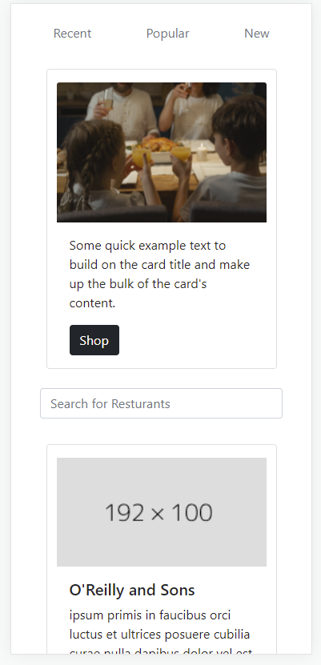
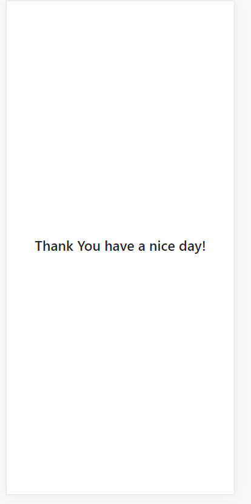
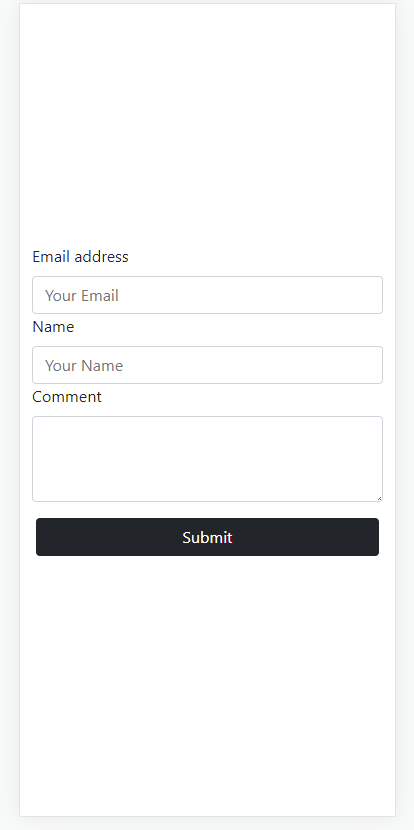
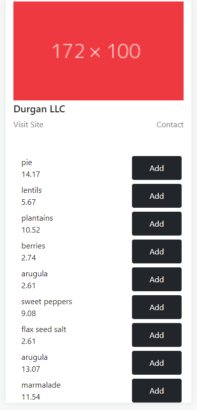
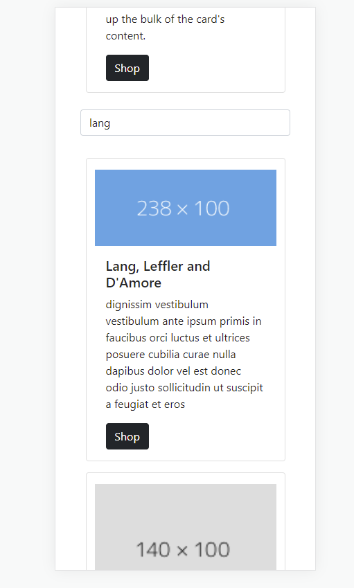



# Project Objective
Designing a modular application that can easily be scaled infinitely. The Restaurant Vendor Model encapsulates the an individual vendor’s data . Views can be programmatically replicated and the app can be scaled horizontally and vertically. Each vendor model contains not only the venders information but an array of Food item objects. Each of these objects can be selected and added to the card which is part of every shopping page model. The cart is an array based data structure with methods to add items and calculate total when the array is edited. 
The application was built with Angular.js in order to create the modularity needed for a horizontal scalability. Google’s Material components in conjunction with CSS we’re used to give the application its Minimalist / Mordern look.
# Project Background 
The UberEats application was the inspiration for this project; it’s a dynamic app that allows users to navigate through hundreds of vendors to find something to eat.The applications home page has two essential tools. A sliding carousel captures the top third of the page on initial load. The carrousel helps the user navigate between their most recent, popular and the newest vendor. Below this sits a search bar where you can filter results by vendor’s name and food type. The UI was designed to mimic UberEats ability to quickly navigate 500 vendors in it built in Json dataset.
# ScreenShots

